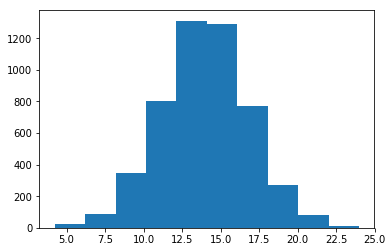
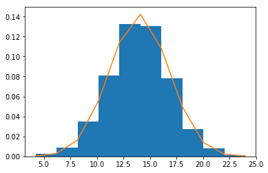
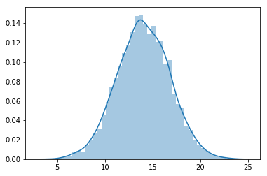
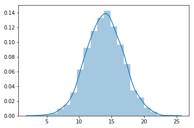

# Gaussian/Normal Distribution - Lab

## Introduction

In this lab we shall learn how to generate random normal distributions in python. We shall look into visualising a histogram and building a density function using the formula as well as seaborn's built in functions. 

## Objectives
You will be able to:
* Generate random normal distributions in python with given parameters
* Calculate the density function for normal distributions
* Use seaborn to visualize distributions with histograms and density functions

## A quick refresher! 
Here's the formula for calculating normal distribution density function.


#### First generate a normal distribution containing 5000 values with mu=14 and sigma = 2.8


```python
import numpy as np
import matplotlib.pyplot as plt
import seaborn as sns
```


```python
# Generate a random normal variable with given parameters , n=5000
mu = 14
sigma = 2.8
normal_dist = np.random.normal(mu, sigma, 5000)
```

#### Calculate a normalized histogram for this distribution in matplotlib - use bin size = 20. 
#### Get the bin positions and count for each bin 

Refer to [official documentation](https://matplotlib.org/api/_as_gen/matplotlib.pyplot.hist.html) to view input and output options for `plt.hist()`


```python
# Calculate a histogram for above data distribution
count, bins, ignored  = plt.hist(normal_dist)
```





```python
ignored
```


    <a list of 10 Patch objects>


#### Calculate the density function (using above formula) with mu, sigma and bin information calculated above .


```python
# Calculate the normal Density function 
density = 1 / (sigma * np.sqrt(2 * np.pi)) * np.exp( - ( bins - mu)** 2 / (2 * (sigma**2) ))
#density = 1/ (sigma * np.sqrt(2 * np.pi)   ) * np.exp( - (bins - mu)**2 / (2 * sigma**2))
```


```python
density
```


    array([0.00032161, 0.00294821, 0.01641661, 0.05552671, 0.11408092,
           0.14236942, 0.10792275, 0.04969376, 0.013899  , 0.00236133,
           0.00024368])


#### Plot the histogram and density function


```python
plt.hist(normal_dist, density=True)
plt.plot(bins, density)
```


    [<matplotlib.lines.Line2D at 0x7ff70059ff60>]





#### Visualize the distribution using seaborn and plot the KDE


```python
# Plot histogram along with the density function
sns.distplot(normal_dist)
```

    /anaconda3/envs/learn-env/lib/python3.6/site-packages/scipy/stats/stats.py:1713: FutureWarning: Using a non-tuple sequence for multidimensional indexing is deprecated; use `arr[tuple(seq)]` instead of `arr[seq]`. In the future this will be interpreted as an array index, `arr[np.array(seq)]`, which will result either in an error or a different result.
      return np.add.reduce(sorted[indexer] * weights, axis=axis) / sumval


    <matplotlib.axes._subplots.AxesSubplot at 0x7ff6e01cb7b8>





```python

```


    <matplotlib.axes._subplots.AxesSubplot at 0x1a19d4cda0>





## Summary

In this lab we saw how to generate random normal distributions in python using numpy. We also looked into calculating the density for gaussian distributions using the general formula as well as seaborn's kde. We shall now move on to see how we can analyze such variables for answering analytical questions. 
